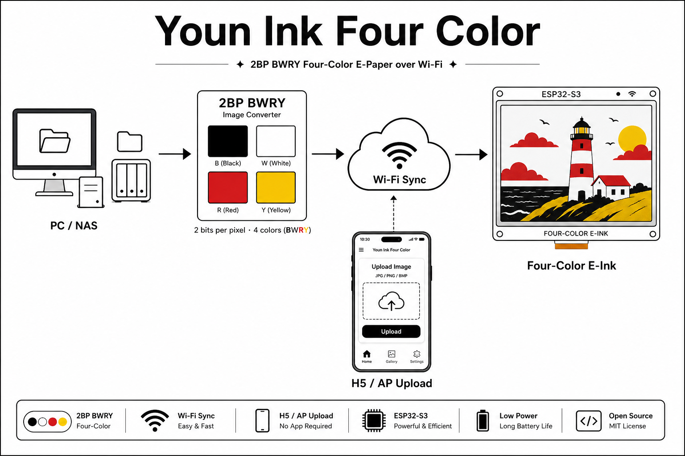

# ZecTrix Photo Frame Firmware

基于 [LazyYoun/youn-ink-fourcolor-firmware](https://github.com/LazyYoun/youn-ink-fourcolor-firmware)（xiaozhi 衍生）裁剪出的**纯相框固件**，面向 ZecTrix ESP32-S3 4.2 寸四色墨水屏（BWRY / SSD2683）。

本仓库为 fork（`vantis-zh/zectrix-photo-frame`），工作分支 `feat/202609/photo-frame-mode`。原项目的语音助手、待办、天气/新闻/电子书等页面以及 `server/`、`frontend/` 前后端服务在本分支已全部移除（被裁剪的代码保留在 `firmware/components_disabled/`，上游 `2bp` 分支仍维护完整功能）。



## 功能

- **相框主界面**：开机显示已存照片（SPIFFS 本地存储，仅保留最新一张 `remote00`）；手动唤醒/上电不自动换图。
- **拉取新图**：正面 BOOT 单击从图片源拉取随机图片，JPEG → 2bpp BWRY 抖动后上屏。默认图源 `https://loremflickr.com/{W}/{H}`，可在设置页循环切换或经 NVS `remote_photo`/`remote_img_url` 配置（URL 模板支持 `{W}`/`{H}` 占位）。
- **自动刷新**：三种模式，到点通过深睡 RTC 定时唤醒拉图：
  - `关闭`：不布防定时唤醒，仅手动 BOOT 拉图
  - `间隔时长`：15 分钟 ~ 24 小时档位（分钟/小时）
  - `固定时间`：每日 HH:MM（默认 `00:00`，兼容旧"每日 0 点刷新"行为）
- **Wi-Fi 配网门户**：UP+DOWN 长按进入，手机连接设备热点访问 `http://192.168.4.1`，共三个标签页：
  - `Wi-Fi Config`：扫描/选择 AP、密码配置
  - `Advanced`：OTA 地址、发射功率等
  - `Other`：一键 "Open Settings on Device"，设备端自动跳转设置页（38 种语言）
- **设备设置页**（墨水屏上按键操作，共 9 项）：系统 / 重启 / 图片（拉取新图、图片来源）/ **时区**（16 个预置时区列表选择，保存即时生效）/ **自动刷新**（模式选择 + 时间设置）/ 关于 / 固件版本。
- **绿色 LED**（GPIO3）：
  - 平时（电池/空闲/充满）**熄灭**
  - 插电脑 USB（刷机会话，USB-Serial-JTAG 枚举）**常亮**；esptool 实际写入的 ROM 下载窗口期除外（该阶段用户代码不运行，引脚悬空，软件无法点亮）
  - 充电中每 3 秒亮闪；按键/深睡唤醒时 120ms 亮点脉冲
- **深度休眠省电**：同步间隔（默认 30 分钟）结束后进入 deep sleep，由 RTC 定时唤醒或按键唤醒；充电中不休眠。

## 按键说明

| 按键 | 行为 |
| --- | --- |
| BOOT 单击 | 相册页拉取新图；设置页/对话框中为确认 |
| UP / DOWN 单击 | 相册翻页、设置页/对话框上下移动 |
| DOWN 长按 | 进入设置页 |
| UP 长按 | 设置页返回相册 |
| UP+DOWN 长按 | 进入 Wi-Fi 配网门户 |
| BOOT 长按 | 配网模式下退出配网回相册 |

时区/自动刷新对话框：BOOT 短按切换字段（时→分→确认）、BOOT 长按保存、UP/DOWN 调整（分钟步进 15）、UP/DOWN 长按取消。

## 持久化配置（NVS）

| Namespace | Key | 说明 |
| --- | --- | --- |
| `frame` | `tz` | POSIX TZ 串（如 `CST-8`），SNTP 恒 UTC，仅影响本地显示与固定时间语义 |
| `frame` | `refresh_mode` | 0=关闭 / 1=间隔 / 2=固定时间（默认 2） |
| `frame` | `refresh_interval` / `refresh_unit` | 间隔时长与单位 |
| `frame` | `refresh_time` | 固定时间（日内分钟数） |
| `remote_photo` | `remote_img_url` | 图片源 URL 模板 |

Wi-Fi 凭据由 `78__esp-wifi-connect` 组件自行管理。

## 固件

固件位于 `firmware/`，基于 **ESP-IDF v6.1-rc1**（EIM 安装），`PROJECT_VER` 见 `firmware/CMakeLists.txt`（当前 `6.5.9`），目标 `esp32s3`，16MB Flash。

### 编译

`build.sh` 会自动探测 ESP-IDF 环境，无需手动 source。命中即停：

1. 当前 shell 已有的 `idf.py`
2. 显式指定的 `export.sh`：`IDF_EXPORT_PATH` → `IDF_PATH`
3. EIM 安装自动探测：`~/.espressif/tools/activate_idf_*.sh`（取版本号最高的一个）
4. 常见安装路径下的 `export.sh`：`~/.espressif/v*/esp-idf`、`~/esp/esp-idf`

多版本 IDF 时建议在 `firmware/.env` 里显式指定（`.env` 已在 `.gitignore` 中）：

```bash
IDF_EXPORT_PATH=/Users/you/.espressif/v6.1-rc1/esp-idf
# 或 EIM 方式
IDF_ACTIVATE_SCRIPT=/Users/you/.espressif/tools/activate_idf_v6.1-rc1.sh
```

> 注意：EIM 的 activate 脚本只把 `idf.py` 定义成 shell 函数，子进程解析不到。
> `build.sh` 会自动补上 `PATH=$IDF_PATH/tools:$PATH`；如果你自己在脚本里激活，记得手动补这一句。

直接打包（含 fullclean、注入 OTA 地址、生成 releases zip）：

```bash
cd firmware
./build.sh
./build.sh --no-rebuild            # 增量编译
./build.sh --ota-url https://...   # 覆盖 OTA 地址
```

只编译、不走打包流程时，手动初始化环境：

```bash
cd firmware
source ~/.espressif/tools/activate_idf_v6.1-rc1.sh   # EIM 安装
# 或传统方式：source <你的 esp-idf 目录>/export.sh
idf.py build
```

### 烧录

```bash
# 方式一：idf.py（在 firmware/ 目录）
idf.py -p /dev/cu.usbmodem* flash monitor

# 方式二：独立构建目录下用 esptool 直刷
cd <构建目录>
python -m esptool --chip esp32s3 -p /dev/cu.usbmodem1101 -b 460800 \
  --before default-reset --after hard-reset write-flash "@flash_args"
```

刷机时绿色 LED 会熄灭（芯片进入 ROM 下载模式，用户代码不运行），刷完复位即恢复。

### 屏幕配置

固件 Kconfig 中有屏幕类型选择：

```text
ZECTRIX_EPD_PANEL_4COLOR_SSD2683  四色 BWRY 屏（本板默认）
ZECTRIX_EPD_PANEL_1BPP            黑白 1bpp 屏
```

## 目录结构

```text
.
├── firmware/                 ESP32-IDF 固件（本项目主体）
│   ├── main/
│   │   ├── application.cc    应用调度、设置页、深睡定时唤醒
│   │   ├── common/           frame_settings（时区/自动刷新）、remote_photo_service（拉图）
│   │   ├── ui/renderers/     RawDraw 渲染器（相册、设置页、列表/时间对话框）
│   │   └── boards/zectrix-s3-epaper-4.2/   板级支持（电源、LED、按键、充电检测、RTC、NFC）
│   └── components_disabled/  已裁剪功能的原代码（demo_renderers、streaming、esp_video 等）
├── server/                   仅剩历史遗留的 mock_client.py（服务端已随裁剪移除）
├── README.md
└── package.json              仓库级辅助命令（firmware:build 等）
```

## 恢复被裁剪的功能

上游 `2bp` 分支保留完整 AI 助手功能。本分支恢复某功能时，把对应目录从 `firmware/components_disabled/` 挪回 `firmware/components/`（或 `main/` 对应位置），并在 `CMakeLists.txt` / `ui_manager` 中重新接线。注意：

- `EXCLUDE_COMPONENTS` 挡不住组件管理器按 manifest 安装的依赖，`esp_video` 之类需改 `main/idf_component.yml`（该组件与 IDF 6.1-rc1 的 SPI slave API 不兼容，已移除）。
- `main/rawdraw/font_engine.h` 对包含顺序敏感：同时涉及 rawdraw 与 lvgl 的编译单元必须先包含 `rawdraw_ui_manager.h`，否则 LVGL 类型探测失败触发兜底定义冲突。

## 致谢

- 上游项目：[LazyYoun/youn-ink-fourcolor-firmware](https://github.com/LazyYoun/youn-ink-fourcolor-firmware)（xiaozhi 生态）
- 本 fork 聚焦纯相框场景：轮转图片 + 配网门户 + 设备端设置 + 深睡定时刷新。
